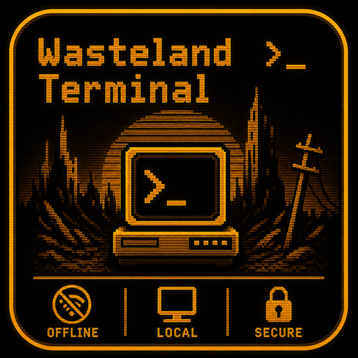

# Wasteland Terminal v0.4



A highly secure, offline-first LLM chat application with a retro-futuristic TUI-like graphical interface.

## Overview

Wasteland is a local LLM inference client built in pure C with a vintage PC-inspired amber-on-black CRT terminal aesthetic. It runs entirely offline once a model is loaded, and uses Linux seccomp (where available) to physically prevent the process from opening any new IP socket for the rest of its lifetime.

## Features

- **Offline-first** — All inference happens locally via llama.cpp
- **Hard network lockdown** — Linux seccomp kills the process if it ever opens a new `AF_INET` / `AF_INET6` / `AF_PACKET` socket once a model is loaded (no-op on macOS/Windows)
- **Retro UI** — Amber (`#FFB000`) monochrome CRT terminal aesthetic via Nuklear; property widgets, scrollbars, and all controls share the same palette
- **Threaded** — Non-blocking UI at 60 FPS with background inference, async model loading, and a detached download thread
- **Async model load** — UI stays responsive during multi-second GGUF load
- **Model Management** — Download from HuggingFace, load / **unload** / delete local `.gguf` files; the local vault is sorted lexicographically for stable ordering
- **Stop generation** — `■` button cancels an in-flight response within one token; also interrupts the prompt prefill phase (no more waiting through a long context decode)
- **Chat template** — Uses each model's built-in template (`llama_chat_apply_template`) so instruction-tuned models behave correctly
- **Multi-turn memory** — Full conversation history is fed to the model on every turn so it remembers previous exchanges; context is managed automatically
- **Context management** — CTX bar shows live token usage. `[ COMPACT ]` drops the oldest turn, saves the compacted history to disk, and mirrors the result into the inference thread immediately. Auto-compact triggers when usage exceeds 80 % after a generation
- **Configurable inference settings** — N\_CTX (512–262 144) and Temperature (0.10–2.00) are adjustable from the left panel and persist across sessions; N\_CTX takes effect on the next model load, Temperature applies from the next prompt
- **Repetition-penalty sampler** — Replaces the old greedy sampler with a stacked penalties → top\_k → top\_p → temperature → distribution chain that prevents small models from looping into repeated paragraphs
- **Multiple Chats** — Create, load, and switch between named chat sessions; auto-named from the first user message and then refined by the model into a contextual 3–5 word title; persisted to `chats/*.txt` with simple RC4 obfuscation
- **Built-in behaviour rules** — A base system prompt is always active: instructs the model to output plain text (no markdown), be concise, match the user's language, and understand it is running offline. The user-configurable system prompt is appended on top
- **System Prompt** — Configure and persist an additional system prompt to further guide model behaviour (`system_prompt.txt`)
- **Smart Reasoning** — `<think>` reasoning blocks are displayed dimmed in the UI (with a "▒ thinking" label) and automatically excluded from the `◈` copy-to-clipboard text; each turn is rendered in its own box so user prompts never appear inside assistant reply blocks; false-positive detection (e.g. `` `<think>` `` in prose) is suppressed via line-start guard
- **Auto-scroll + word wrap** — Chat pins to the bottom and wraps long lines to the panel width
- **Download Progress** — Real-time progress bar with filename, percent, and **cancel** support
- **Fast close** — Clicking X hides the window instantly, signals the worker via `inference_request_stop()`, joins with a 1.5 s timeout, and falls back to `_Exit` if the worker is still mid-decode
- **Auto-update check** — On startup the app queries GitHub Releases in the background; if a newer version exists, an orange banner appears under the header with the available version
- **Unicode & HiDPI** — DejaVu Sans Mono is embedded in the binary (no external font files needed); covers Basic Latin, Cyrillic (Ukrainian), and Geometric Shapes (▶ ■). Font scales automatically with display DPI so text is never tiny on Retina or Windows HiDPI displays
- **Cross-Platform** — Linux, macOS, Windows (MinGW/MSVC)

## Tech Stack

- **Language:** Pure C (C11)
- **Inference:** llama.cpp (C API, current — not deprecated aliases)
- **GUI:** Nuklear (immediate-mode) + SDL2 + OpenGL 2.1
- **Networking:** libcurl (download path only; isolated in `network.c`)
- **Security:** Linux seccomp-bpf — `SCMP_ACT_KILL_PROCESS` on `socket(AF_INET|AF_INET6|AF_PACKET, …)`
- **Build:** CMake 3.16+

## Building

### Linux

```bash
# Install deps (Debian/Ubuntu)
sudo apt install cmake libsdl2-dev libcurl4-openssl-dev libseccomp-dev

# Install deps (Arch)
sudo pacman -S cmake sdl2 curl libseccomp

# Build
./build.sh
```

### macOS

```bash
# Install deps (Homebrew)
brew install cmake sdl2 curl

# Build
git submodule update --init --recursive
mkdir build && cd build
cmake ..
make -j$(sysctl -n hw.ncpu)
```

### Windows (MSYS2 / MinGW)

```bash
# Install deps
pacman -S mingw-w64-x86_64-cmake mingw-w64-x86_64-SDL2 mingw-w64-x86_64-curl

# Build
git submodule update --init --recursive
mkdir build && cd build
cmake .. -G "MinGW Makefiles"
mingw32-make -j$(nproc)
```

### Windows (MSVC)

```powershell
# Install deps via vcpkg
vcpkg install sdl2:x64-windows curl:x64-windows

# Build
git submodule update --init --recursive
mkdir build && cd build
cmake .. -DCMAKE_TOOLCHAIN_FILE=C:\vcpkg\scripts\buildsystems\vcpkg.cmake
cmake --build . --config Release
```

## Cross-Compilation

### Windows exe from Linux

```bash
sudo apt install mingw-w64 cmake
mkdir build-win && cd build-win
cmake .. -DCMAKE_TOOLCHAIN_FILE=../cmake/mingw-w64-x86_64.cmake
cmake --build . -j$(nproc)
# Produces: Wasteland.exe
```

See `CROSS_COMPILE.md` for full details including MXE dependency setup.

### macOS dmg from Linux

**Not recommended.** Apple requires macOS SDK and code signing. Use GitHub Actions or build on a real Mac.

## Prebuilt Binaries

GitHub Actions automatically builds and releases for all platforms on every tag:

| Platform | Artifact |
|----------|----------|
| Linux x86\_64 (Ubuntu/Debian) | `wasteland_0.4_amd64.deb` — install with `sudo apt install ./wasteland_0.4_amd64.deb` |
| Linux ARM64 (Raspberry Pi 5, Ampere, etc.) | `wasteland_0.4_arm64.deb` — install with `sudo apt install ./wasteland_0.4_arm64.deb` |
| macOS (universal) | `Wasteland-macos.dmg` — one .app that runs natively on both Apple Silicon and Intel (deployment target 11.0+) |
| Windows | `Wasteland-windows.exe` — single self-contained binary (SDL2/curl statically linked) |

Push a tag to trigger a release:

```bash
git tag v0.4
git push origin v0.4
```

## Running

```bash
cd build
./Wasteland        # Linux / macOS
Wasteland.exe      # Windows
```

Place `.gguf` model files in the `models/` directory, or download them via the built-in HuggingFace panel. The application **does not** auto-load anything on boot — you pick the model explicitly so the network stays available for downloads until you commit.

## Project Structure

```
Wasteland/
├── CMakeLists.txt          # Cross-platform build configuration
├── build.sh                # One-shot build script (Linux auto-detect)
├── README.md               # This file
├── CLAUDE.md               # AI assistant context
├── AGENTS.md               # Agent conventions & style guide
├── SKILLS.md               # Domain skill reference
├── CROSS_COMPILE.md        # Cross-compilation guide
├── .gitignore              # Ignore build artifacts & models
├── cmake/
│   └── mingw-w64-x86_64.cmake  # MinGW toolchain for Windows builds
├── .github/
│   └── workflows/
│       └── build.yml       # CI/CD: builds Linux/macOS/Windows + releases
├── src/
│   ├── main.c              # Entry point, SDL loop, thread spawn, fast-shutdown, settings persistence
│   ├── ui.c / ui.h         # Nuklear layout, full amber theme, per-turn chat boxes, compact pipeline
│   ├── inference.c / .h    # llama.cpp wrapper, async load, worker thread, <think> filter, sampler stack, tunables
│   ├── network.c / .h      # libcurl downloader & seccomp lockdown
│   ├── agent.c / agent.h   # Tool-using ReAct agent loop (read_file, list_dir, write_file, apply_edit)
│   ├── nuklear_impl.c      # Nuklear + SDL/GL2 backend impl
│   └── nuklear_sdl_gl2.h   # Nuklear SDL2/OpenGL2 backend
├── include/                # nuklear.h
├── third_party/
│   └── llama.cpp/          # Git submodule (vendored llama.cpp)
├── vendor/
│   └── llama.cpp -> ../third_party/llama.cpp  # symlink the CMake build uses
└── models/                 # Local .gguf storage (gitignored)
```

## UI Guide

### Left Panel

- **Hub Models** — 5 predefined HuggingFace repos with radio buttons (small, real, public instruction-tuned GGUFs — Qwen 2.5 0.5B/1.5B, Gemma 3 1B IT, SmolLM2 1.7B Instruct, Qwen3.6 35B A3B). The list is defined in `ui.c` and resolved live via the HF API
- **Custom ID or URL** — Enter any HF repo ID or full `/blob/main/` URL (the downloader auto-rewrites `/blob/main/` → `/resolve/main/`)
- **Target** — Shows resolved download target before clicking `[ DOWNLOAD ]`
- **Progress** — Filename + percent during download, with `[ CANCEL ]` button
- **Local Vault** — List of `.gguf` files with size:
  - `[ LOAD: name | size ]` — start async load (UI stays responsive)
  - `[ LOADING: name | size ... ]` — in flight; other LOAD/DELETE buttons are disabled
  - `[ UNLOAD: name | size ]` — currently loaded model; click to free it
  - `[ DELETE ]` — remove the file from disk (disabled while a load is in flight or generation is running)
  - `[ REFRESH ]` — re-scan `models/`
- **Inference Settings** — Controls visible at all times; values persist in `wasteland.cfg`:
  - **N\_CTX** (512–262 144, step 1024) — context window size; change takes effect on the next model load
  - **TEMP** (0.10–2.00, step 0.05) — sampling temperature; change takes effect immediately on the next prompt
- **System Prompt** — Multi-line input for system instructions, saved between sessions
- **Agent Mode** — Toggle tool-using ReAct loop; set a workspace directory for sandboxed file access
- **Chats** — Manage multiple persistent chat sessions:
  - `[ NEW CHAT ]` — Start a new session. It is initially named from your first message, then the model generates a contextual 3–5 word title after its first reply and the chat file is renamed automatically.
  - `[ LOAD ]` / `[ ACTIVE ]` — Switch between chat sessions
  - `[ DEL ]` — Delete a chat session
- **Status footer** — "NET: LOCKDOWN ACTIVE" once a model is loaded; otherwise "NET: DISCONNECTED (READY)"
- **Update banner** — If a newer release exists on GitHub, an orange banner appears under the app header with the available version. The check runs once at startup in a background thread before any network lockdown.

### Right Panel (Collapsible)

- **Chat history** — Scrollable, word-wrapped, auto-pins to the bottom on new tokens.
  - Each user/assistant exchange is rendered in its own edit box — user prompts never bleed into the previous assistant reply.
  - Reasoning blocks (`<think>`) are rendered in a separate dimmed box with a "▒ thinking" label.
  - Empty think boxes (e.g. from `<think></think>` or a cancelled mid-think generation) are suppressed.
- **CTX bar** — `CTX: used / max (pct%)` with a progress bar. Turns orange above 75 %, red above 90 %.
- **`[ COMPACT ]`** — Drop the oldest turn, persist the result to disk, mirror into inference. Disabled during generation. Shows feedback in the status line.
- **Input** — `>` prompt with text field
- **`▶` (Play)** — submit the prompt (Enter also works)
- **`■` (Stop)** — replaces Play while the model is generating; cancels the current response
- **Status message** — temporary non-intrusive notifications appear beneath the input box

## Security Model

1. App boots in **offline-capable** state with the network reachable so the user can download models.
2. **Nothing is loaded automatically.** The user picks a model via the UI.
3. When the user clicks `[ LOAD ]` and the load succeeds, `lockdown_network()` runs:
   - **Linux:** installs a seccomp-bpf filter that kills the process if it ever calls `socket(AF_INET, …)`, `socket(AF_INET6, …)`, or `socket(AF_PACKET, …)`. The filter only gates **new** socket creation — already-open file descriptors (notably the X11 / Wayland Unix-domain socket the GUI uses every frame) keep working.
   - **macOS / Windows:** no-op (platform limitation), network remains available.
4. seccomp filters cannot be removed for the lifetime of the process. Unloading a model does not lift the lockdown — restart to download more models.
5. The download path lives entirely in `network.c` and is gated by `state->network_lockdown` in the UI, so the `[ DOWNLOAD ]` button hides the moment the lockdown is active.

## License

See LICENSE file.
